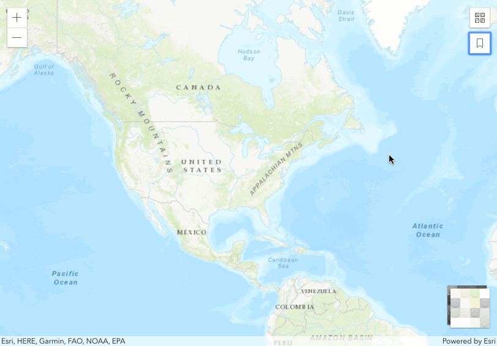

# Blocky Widgets! 🧱

This demo shows how widget rendering can be customized to fit a theme.




### Overview

For our demo, we will customize the Bookmarks' thumbnails to make them look 'blocky'. We will do this by extending the widget and wiring up a utility in a custom rendering method. 

### Main parts

* `index.html` - demo entry point that references main application  
* `main.ts` - simple mapping application with custom bookmarks  
* `BlockyBookmarks.tsx` - custom Bookmarks widget  
* `blockify.ts` - utility module to help 'blockify' thumbnails  

### Steps

1. We'll start in `BlockyBookmarks.tsx`. This file has some boilerplate code to extend a widget, as well as some imports we'll use later on.

  ```tsx
  import Bookmarks = require("esri/widgets/Bookmarks");
  import Bookmark = require("esri/webmap/Bookmark");
  import i18nCommon = require("dojo/i18n!esri/nls/common");
  
  import { transform } from "../support/blockify";
  import { declared, subclass } from "esri/core/accessorSupport/decorators";
  import { tsx } from 'esri/widgets/support/widget';
  
  const CSS = {
    bookmark: "esri-bookmarks__bookmark",
    bookmarkButton: "esri-bookmarks__bookmark-button",
    bookmarkImageContainer: "esri-bookmarks__bookmark-image-container",
    bookmarkIcon: "esri-bookmarks__bookmark-icon",
    bookmarkImage: "esri-bookmarks__image",
    bookmarkName: "esri-bookmarks__bookmark-name",
    bookmarkActive: "esri-bookmarks__bookmark--active",
  
    // common
    esriButton: "esri-button",
    esriButtonTertiary: "esri-button--tertiary",
    iconEdit: "esri-icon-edit",
    widgetIcon: "esri-icon-bookmark"
  };
  
  // use interface merging to avoid re-implementing private members
  interface BlockyBookmarks {
    _showEditBookmarkForm: Function;
    _goToBookmark: Function;
    editingEnabled: boolean;
  }
  
  @subclass("esri.demos.BlockyBookmarks")
  class BlockyBookmarks extends declared(Bookmarks) {
  
  }
  
  export = BlockyBookmarks;
  ```
  
2. If we were to reload the application, we would see the OOB behavior from the Bookmarks widget. This is expected because we are extending the OOB widget.

3. Next, by looking at the [Bookmarks SDK page](https://developers.arcgis.com/javascript/latest/api-reference/esri-widgets-Bookmarks.html), we can access the view's source code to understand how to customize the thumbnails. The method we'll want to focus on is [`_renderBookmark`](https://github.com/Esri/arcgis-js-api/blob/4master/widgets/Bookmarks.tsx#L436).

4. Let's copy the method over to our custom class. We should now have the basis for our custom rendering method.

5. We have a custom utility module with a method that will blockify™ `<image>` elements, so let's wire it up in our render method. We can do this by using the `afterCreate` rendering hook available to us (see https://developers.arcgis.com/javascript/latest/guide/custom-widget/#widget-rendering for more details)

  ```tsx
  
  ```   

6. If we compile, we should see our widget now render blocky thumbnails. Note that this effect is applied dynamically, and will work for any future bookmarks that are added. Pretty neat!

7. Other widgets in our application also have some sort of thumbnail rendering, so we could apply the same pattern to get a unified look. If you take a look at the other 'Blocky' widgets in the demo folder, you should notice the similarities.

8. Below is the final code for `BlockyBookmarks.tsx`

  ```tsx
  import Bookmarks = require("esri/widgets/Bookmarks");
  import Bookmark = require("esri/webmap/Bookmark");
  import i18nCommon = require("dojo/i18n!esri/nls/common");
  
  import { transform } from "../support/blockify";
  import { declared, subclass } from "esri/core/accessorSupport/decorators";
  import { tsx } from 'esri/widgets/support/widget';
  
  const CSS = {
    bookmark: "esri-bookmarks__bookmark",
    bookmarkButton: "esri-bookmarks__bookmark-button",
    bookmarkImageContainer: "esri-bookmarks__bookmark-image-container",
    bookmarkIcon: "esri-bookmarks__bookmark-icon",
    bookmarkImage: "esri-bookmarks__image",
    bookmarkName: "esri-bookmarks__bookmark-name",
    bookmarkActive: "esri-bookmarks__bookmark--active",
  
    // common
    esriButton: "esri-button",
    esriButtonTertiary: "esri-button--tertiary",
    iconEdit: "esri-icon-edit",
    widgetIcon: "esri-icon-bookmark"
  };
  
  // use interface merging to avoid re-implementing private members
  interface BlockyBookmarks {
    _showEditBookmarkForm: Function;
    _goToBookmark: Function;
    editingEnabled: boolean;
  }
  
  @subclass("esri.demos.BlockyBookmarks")
  class BlockyBookmarks extends declared(Bookmarks) {
  
    // based on https://github.com/Esri/arcgis-js-api/blob/4master/widgets/Bookmarks.tsx
    protected _renderBookmark(bookmark: Bookmark): VNode {
      const { activeBookmark } = this.viewModel;
  
      const { name, thumbnail } = bookmark;
      const title = name || i18nCommon.untitled;
  
      const bookmarkClasses = {
        [CSS.bookmarkActive]: activeBookmark === bookmark
      };
  
      const imageSource = (thumbnail && thumbnail.url) || "";
  
      const imageNode = imageSource ? (
        
      ) : (
                          <span aria-hidden="true"
                                class={this.classes(CSS.bookmarkIcon, CSS.widgetIcon)} />
                        );
  
      const imageContainerNode = <div
        class={CSS.bookmarkImageContainer}>{imageNode}</div>;
  
      const editContainer = this.editingEnabled ? (
        <div key="edit-container">
          <button
            title={i18nCommon.edit}
            aria-label={i18nCommon.edit}
            data-bookmark-item={bookmark}
            onclick={this._showEditBookmarkForm}
            bind={this}
            class={this.classes(CSS.esriButton, CSS.esriButtonTertiary)}
          >
            <span aria-hidden="true" class={CSS.iconEdit} />
          </button>
        </div>
      ) : null;
  
      return (
        <li key={bookmark} class={this.classes(CSS.bookmark, bookmarkClasses)}>
          <button
            bind={this}
            data-bookmark-item={bookmark}
            onclick={this._goToBookmark}
            class={CSS.bookmarkButton}
          >
            {imageContainerNode}
            <span class={CSS.bookmarkName}>{title}</span>
            {editContainer}
          </button>
        </li>
      );
    }
  
  }
  
  export = BlockyBookmarks;
  ``` 

