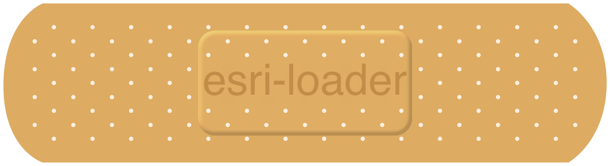

<!-- .slide: data-background="../common/images/bg-1.png" -->
<!-- .slide: class="title" -->

<h1 style="text-align: left; font-size: 80px;">ArcGIS API for JavaScript</h1>
<h2 style="text-align: left; font-size: 60px;">Using Webpack and React</h2>
<p style="text-align: left; font-size: 30px;">Rene Rubalcava</p>
    <p style="text-align: left; font-size: 30px;">slides: <a href="https://git.io/Je0yM" target="_blank">https://git.io/Je0yM</a></p>

<!--
Learn to build powerful applications that integrate the ArcGIS API for JavaScript via the ArcGIS webpack plugin or esri-loader. In this session, we’ll use React to build a fast and responsive application that uses modern tooling and techniques.
-->

----
<!-- .slide: data-background="./images/section.png" -->

## React

<p><code>ui = f(s)</code></p>


----

<!-- .slide: data-background="../common/images/ReactArcGISVennDiagram.svg" -->


----

<!-- .slide: data-background="../common/images/ReactArcGISVennDiagram2.svg" -->

----

<!-- .slide: data-background="../common/images/ReactArcGISVennDiagram3.svg" -->

----

<!-- .slide: data-background="../common/images/ReactMapAppLight.svg" -->

----

<!-- .slide: data-background="../common/images/ReactMapAppDark.svg" -->

----

<!-- .slide: data-background="../common/images/ReactMapAppDarkComponents.svg" -->

----

<!-- .slide: data-background="../common/images/ReactMapAppDarkArcGISCode.svg" -->

----

<!-- .slide: data-background="../reveal.js/img/2019/devsummit/bg-3.png" class="code-md" data-transition="fade" -->
### Create a map component that [renders](https://reactjs.org/docs/react-component.html#render) a `<div>`

```jsx
class EsriMap extends React.Component {


  render() {
    return <div className="esri-map" />;
  }
}
```

----

<!-- .slide: data-background="../reveal.js/img/2019/devsummit/bg-3.png" class="code-md" data-transition="fade" -->
### Get a [ref](https://reactjs.org/docs/refs-and-the-dom.html)erence to the `<div>`

```jsx
class EsriMap extends React.Component {
  constructor(props) {
    super(props);
    this.mapDiv = React.createRef();
  }
  render() {
    return <div className="esri-map" ref={this.mapDiv} />;
  }
}
```

----

<!-- .slide: data-background="../reveal.js/img/2019/devsummit/bg-3.png" class="code-md" data-transition="fade" -->
### Create a map [after the component renders](https://reactjs.org/docs/react-component.html#componentdidmount)

```jsx
componentDidMount() {
  const container = this.mapDiv.current;
  const basemap = themeToBasemap(this.props.theme);
  
  // imported from ./utils/map.js
  loadMap(container, basemap)
  .when(view => { this._view = view });
}
```

----

<!-- .slide: data-background="../reveal.js/img/2019/devsummit/bg-3.png" class="code-md" data-transition="fade" -->
### Handle [updated `theme` (prop)](https://reactjs.org/docs/react-component.html#componentdidupdate)

```jsx
componentDidUpdate(prevProps) {
  if (this.props.theme !== prevProps.theme) {
    if (this._view) {
      const basemap = themeToBasemap(this.props.theme);
      this._view.map.basemap = basemap;
    }
  }
}
```

----

<!-- .slide: data-background="../reveal.js/img/2019/devsummit/bg-3.png" class="code-md" data-transition="fade" -->
### [Clean up](https://reactjs.org/docs/react-component.html#componentwillunmount)

```jsx
componentWillUnmount() {
  if (this._view) {
    this._view.container = null;
    delete this._view;
  }
}
```

----

<!-- .slide: -->

### 🎉 Success! 🎉

<p class="fragment">✅ created a map using React DOM & state</p>
<p class="fragment">✅ relay state changes state from React to the ArcGIS API</p>

----

<!-- .slide: class="code-md" data-transition="fade" -->
### 🤔 Relay state changes from ArcGIS API to React?


----

<!-- .slide: data-background="../reveal.js/img/2019/devsummit/bg-3.png" class="code-md" data-transition="fade" -->
### Add `mapLoaded` to App state

```jsx
class App extends React.Component {
  state = { theme: 'light', mapLoaded: false }


  render() {
    return <EsriMap theme={theme} />;
  }
}
```

----

<!-- .slide: data-background="../reveal.js/img/2019/devsummit/bg-3.png" class="code-md" data-transition="fade" -->
### Pass a callback to the map component as a prop

```jsx
class App extends React.Component {
  state = { theme: 'light', mapLoaded: false }
  onMapLoad () => { this.setState({ mapLoaded: true }) }

  render() {
    return <EsriMap theme={theme} onLoad={onMapLoad} />;
  }
}
```

----

<!-- .slide: data-background="../reveal.js/img/2019/devsummit/bg-3.png" class="code-md" data-transition="fade" -->
### Call the `onLoad()` callback when the view is ready

```jsx
componentDidMount() {
  const container = this.mapDiv.current;
  const basemap = themeToBasemap(this.props.theme);
  loadMap(container, basemap).when(view => {
    this._view = view;
    this.props.onLoad && this.props.onLoad();
  });
}
```

----

<!-- .slide: -->

### 😒 APIs have changed...

<p class="fragment">... concepts remain the same 🙂</p>

<ul>
  <li class="fragment">✅ pass `state` & `callbacks` to map component via `props`</li>
  <li class="fragment">✅ use `refs` to access DOM nodes</li>
  <li class="fragment">✅ use a module to encapsulate the ArcGIS API</li>
  <li class="fragment">✅ call functions from that module after render & update</li>
</li>

----

<!-- .slide: -->

## Modern React APIs and the ArcGIS API

----

### Manage state in React

* You may not need Redux/MobX
* Context is powerful, and injectable

----

### React Context API

* Create a Context

```ts
// main application context
export const AppContext = createContext<ContextProps>({
  state: initialState,
  // add methods to communicate
  setState: (a: any) => void;
});
```

----

### React Context API

* Create a Provider

```tsx
// main application provider
export const AppProvider = ({ children }: AppProviderProps) => {
  ...
  const value = {
    state,
    setState
  };
  return (
      <AppContext.Provider value={value}>
        {children}
      </AppContext.Provider>
  );
};
```

----

### React Context API

* Use the Provider

```tsx
ReactDOM.render(
    <AppProvider location={location}>
        <AwesomeApp />
    </AppProvider>
  document.getElementById("root")
);
```

----

### React Context API

* Use the Context

```tsx
const AwesomeApp = () => {
  const mapRef = useRef<HTMLDivElement>(null);
  const { state, setState } = useContext(AppContext);
  useEffect(
    () => {
      setState(mapRef.current);
    },
    []
  );
  return (
    <MapContainer webmapid={state.webmapid} ref={mapRef} />
  );
};
```

----

<!-- .slide: data-background="../reveal.js/img/2019/devsummit/bg-4.png" -->

## What the hook?

----

### What have I done?

```ts
const mapRef = useRef<HTMLDivElement>(null);
const { state, setState } = useContext(AppContext);
useEffect(
  () => {
    setState(mapRef.current);
  },
  []
);
```

----

### React hooks

* `useEffect`
* `useState`
* `useContext`
* and more!

- [documentation](https://reactjs.org/docs/hooks-intro.html)

----

### `useEffect`

* Replaces some class lifecycle methods... mostly
  * componentDidMount
  * componentDidUpdate
  * componentWillUnmount

----

### `useEffect`

```ts
let watcher;
useEffect( // happens after render - EVERY TIME
  () => {
    if(watcher) {
      return;
    }
    watcher = mapView.watch("stationary", () => {
      // do something
    });
    return () => watcher.remove();
  },
  // when this value changes
  // rerun this hook
  [someProp]
);
```

----

### `useState`

* Manage local state
* Keep it simple

```ts
const [ready, setReady] = useState(false);
// later
setReady(true);
```

----

### `useState`

```ts
// You could do objects as well
const initialState = {
  selectedFeatures: [],
  extent: null
};

const [state, setState] = useState({ ...initialState });
```

----

### `useContext`

* Helps you manage application state
* _Could_ replace redux/mobx

----

### `useContext`

```tsx
const AwesomeApp = () => {
  const mapRef = useRef<HTMLDivElement>(null);
  const { state } = useContext(AppContext);
  return (
    <WebMapComponent webmapid={state.webmapid} />
  );
};
```

----

<!-- .slide: data-background="../reveal.js/img/2019/devsummit/bg-4.png" -->

## Suspense

----

## Hold your Suspense

* Lazy-load React components
* useful in modular apps

```tsx
import React, { lazy } from "react";
// lazy load the components that use Maps
const WebMapView = lazy(() => import("../components/WebMapView"));
// later on
<Suspense fallback={<Placeholder />}>
  <ListView />
  <WebMapView />
</Suspense>
```

----

<!-- .slide: data-background="../reveal.js/img/2019/devsummit/bg-4.png" -->

## Modularize API usage

----

* Do all the API work seperate from your UI
* _Separate content from navigation_ - pattern in PWAs

```ts
// src/data/map.ts
export function initialize(element: Element) {
  view.container = element;
  view.when(() => {
    // magic
  });
}
```

----

* Use in your context or component

```ts
// src/contexts/App.ts
const [ container, setContainer ] = useState<HTMLDivElement>(element);
const loadMap = async () => {
  // lazy load the API
  const map = await import("../data/map");
  map.initialize(container);
};
useEffect(
  () => {
    if (container) {
      loadMap();
    }
  },
  [container]
);
```

----

## Why lazy load the API?

* So webpack can create async bundles
* `bundle1.js` -> `bundle2.js` -> `bundle3.js`
* Only load the resources you need when you need them
* Leads to faster initial loads

----

## Demo

* [Nearby JavaScript](https://developers.arcgis.com/example-apps/nearby-javascript/)

----

<!-- .slide: data-transition="fade" -->
## 😎 [@arcgis/webpack-plugin](https://github.com/Esri/arcgis-webpack-plugin) 👍
<p class="fragment">ArcGIS API 4.7+ only</p>
<p class="fragment">Must be able to configure webpack</p>


----

<!-- .slide: -->

## Popular React Tools & Frameworks

<table class="clis">
  <tbody>
    <tr>
      <td>
        <a href="https://github.com/facebook/create-react-app">
          
          <p>create-react-app</p>
        </a>
      </td>
      <td>
        <a href="https://nextjs.org/">
          
          <p>Next.js</p>
        </a>
      </td>
      <td>
        <a href="https://www.gatsbyjs.org/">
          
          <p>Gatsby</p>
        </a>
      </td>
    </tr>
  </tbody>
</table>
<p class="fragment">All insulate you from 😱 of webpack config</p>

----

<!-- .slide: data-transition="fade" -->
<p>👵 ArcGIS API < 4.7x? 👴</p>
<p class="fragment">🔒 No access to webpack config? 🔒</p>
<p class="fragment">🙈 Don't _want_ to config webpack? 😱</p>

----

<!-- .slide: data-transition="fade" -->
###  No problem. Try [esri-loader](https://github.com/Esri/esri-loader)

<div>
    
</div>

----

<!-- .slide: data-transition="fade" -->
### Works with ArcGIS API [3.x](https://developers.arcgis.com/javascript/3/) <span class="fragment" data-fragment-index="1">_and_ 4.x</span>

<div>
  
  
  
  
</div>

----

<!-- .slide: data-background="../reveal.js/img/2019/devsummit/bg-3.png" class="code-md" data-transition="fade" -->
### Using [esri-loader](https://github.com/Esri/esri-loader#install) with Webpack


<h3><code>npm install --save esri-loader</code></h3>

----

<!-- .slide: data-background="../reveal.js/img/2019/devsummit/bg-3.png" class="code-md" data-transition="fade" -->
### Using [esri-loader](https://github.com/Esri/esri-loader#install) with Webpack


<h3><code>yarn add esri-loader</code></h3>

----

<!-- .slide: data-background="../reveal.js/img/2019/devsummit/bg-3.png" class="code-md" data-transition="fade" -->
### Using [`loadModules()`](https://github.com/Esri/esri-loader#usage)

```js
import { loadModules } from 'esri-loader';

loadModules([
  "esri/Map",
  "esri/views/MapView"
]).then(([Map, MapView]) => {
  // Code to create the map and view will go here
});
```

----

<!-- .slide: data-background="../reveal.js/img/2019/devsummit/bg-3.png" class="code-md" data-transition="fade" -->
### Look [familiar](https://developers.arcgis.com/javascript/latest/sample-code/intro-mapview/index.html)?

```js
// this is what loadModules() does under the hood

require([
  "esri/Map",
  "esri/views/MapView"
], function(Map, MapView) {
  // Code to create the map and view will go here
});
```

----

<!-- .slide: data-background="../reveal.js/img/2019/devsummit/bg-3.png" class="code-md" data-transition="fade" -->
### [Lazy loads the ArcGIS API](https://github.com/Esri/esri-loader#lazy-loading-the-arcgis-api-for-javascript) by default

<pre class="language-js" data-line="2,6">
<code class="language-js">loadModules(["esri/config"]) // <- loads API 1st time
.then(([esriConfig]) => {
  esriConfig.useIdentity = false;
  // don't worry, this won't load the API again!
  loadModules(
    ["esri/Map", "esri/views/MapView"],
  ]).then(([Map, MapView]) => { /* do map things */ });
});</code></pre>

----

<!-- .slide: data-background="../reveal.js/img/2019/devsummit/bg-3.png" class="code-md" data-transition="fade" -->
### Lazy load the ArcGIS CSS

<pre class="language-js" data-line="6">
<code class="language-js">// pass options as a second argument
loadModules(
  ["esri/Map", "esri/views/MapView"],
  // this stylesheet is only loaded once
  { css: "https://js.arcgis.com/4.10/esri/css/main.css" }
]).then(([Map, MapView]) => {
  /* do map things with style! */
});</code></pre>

Note:
for even better initial load performance

----

<!-- .slide: data-background="../reveal.js/img/2019/devsummit/bg-3.png" class="code-md" data-transition="fade" -->
### [Load a specific version of the ArcGIS API](https://github.com/Esri/esri-loader#from-a-specific-version)

```js
const apiUrl = "https://js.arcgis.com/3.30/";
loadModules(
  ["esri/map"],
  {
    url: apiUrl,
    css: `${apiUrl}esri/css/esri.css`
  }
]).then(([Map]) => { /* do old skool map things */ });
```

----

<!-- .slide: data-background="../reveal.js/img/2019/devsummit/bg-3.png" class="code-md" data-transition="fade" -->
### Additional options & patterns

See the esri-loader docs for examples of:
- [configuring Dojo](https://github.com/Esri/esri-loader#configuring-dojo)
- [using ArcGIS types in TS](https://github.com/Esri/esri-loader#arcgis-types)
- and [more](https://github.com/Esri/esri-loader#advanced-usage)

----

<!-- .slide: data-background="../reveal.js/img/2019/devsummit/bg-6.png" -->

## Demo

[Theme Switcher (on CodeSandbox)](https://codesandbox.io/s/8ykw098vw0)

<iframe src="https://codesandbox.io/embed/8ykw098vw0?fontsize=14&module=%2Fsrc%2Futils%2Fmap.js" style="width:100%; height:500px; border:0; border-radius: 4px; overflow:hidden;" sandbox="allow-modals allow-forms allow-popups allow-scripts allow-same-origin"></iframe>

----

<!-- .slide: data-background="../reveal.js/img/2019/devsummit/bg-6.png" -->

## Example: Create ArcGIS App

<a href="https://create-arcgis-app.surge.sh/"></a>

[create-arcgis-app](https://github.com/tomwayson/create-arcgis-app)

----

<!-- .slide: data-background="../reveal.js/img/2019/devsummit/bg-6.png" -->

## Example: Next ArcGIS App

<a href="https://next-arcgis-app.now.sh/"></a>

[next-arcgis-app](https://github.com/tomwayson/next-arcgis-app)

----

<!-- .slide: data-background="../reveal.js/img/2019/devsummit/bg-6.png" -->

## Conclusion

<div>
  
  
  
  
</div>

Notes:
It's never been a better time to be a React dev
It's never been a better time to be a ArcGIS dev
Go forth and prosper

----


----

<!-- .slide: data-background="../common/images/bg-rating.png" -->
