<!-- .slide: data-background="../common/images/bg-1.png" -->
<!-- .slide: class="title" -->

<h1 style="text-align: left; font-size: 80px;">Data Visualization:</h1>
<h2 style="text-align: left; font-size: 60px;">Principles and Techniques</h2>
<p style="text-align: left; font-size: 30px;">Rene Rubalcava</p>
    <p style="text-align: left; font-size: 30px;">slides: <a href="https://git.io/Je0yD" target="_blank">https://git.io/Je0yD</a></p>

<!--
In this session, we’ll cover the principles of data visualization and some useful techniques and methods you can apply to your own work. You will also learn how to use other developer libraries to craft custom data visualizations in your mapping applications.
-->

----

# Principles

----

## Audience

- Who are your users?
- Public
- Internal
- Engineers
- Know your customers

----

## Visual Contrast

- How map features and page elements contrast
- Distinguish between objects and features

----

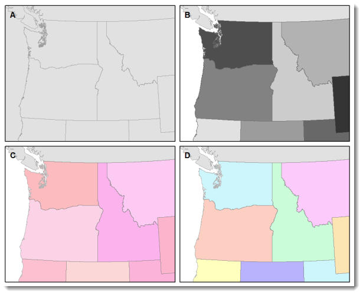

----

## Legibility

- _the ability to be seen and understood_
- Selecting symbols
- Appropriate sizes

----

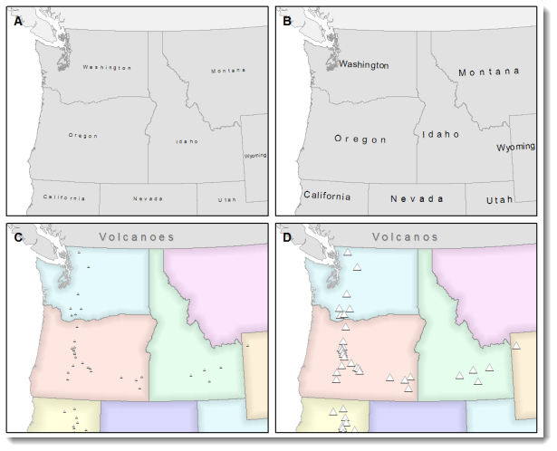

----

## Figure-Ground Organization

- Spontaneous separation of the figure in the foreground from an “amorphous” background
- Where should viewer focus

----

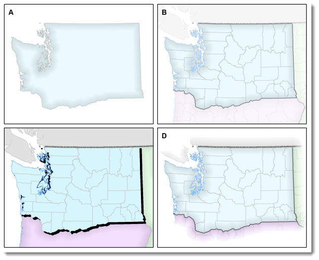

----

## Hierarchical Organization

- _Separate meaningful characteristics and to portray likenesses_
- Visual separation of your map into layers
- Levels of importance

----

## Balance

- Organization of map and elements
- Print media varies from Web media

----

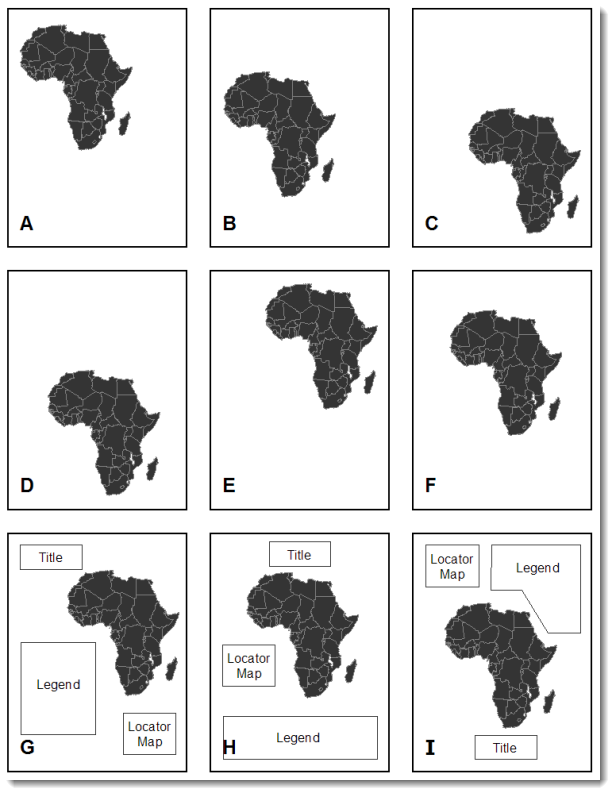

----

## Interactivity

- Provide clarity
- Try not to confuse

----

<!-- .slide: data-background="./images/section.png" -->

# Visualization

----

## Whart can we visualize?

<ul style="float: left;">
<li style="text-align: left; font-size: 60px;">Where?</li>
<li style="text-align: left; font-size: 60px;">What?</li>
<li style="text-align: left; font-size: 60px;">When?</li>
<li style="text-align: left; font-size: 60px;">Where?</li>
<li style="text-align: left; font-size: 60px;">Multivariate</li>
</ul>

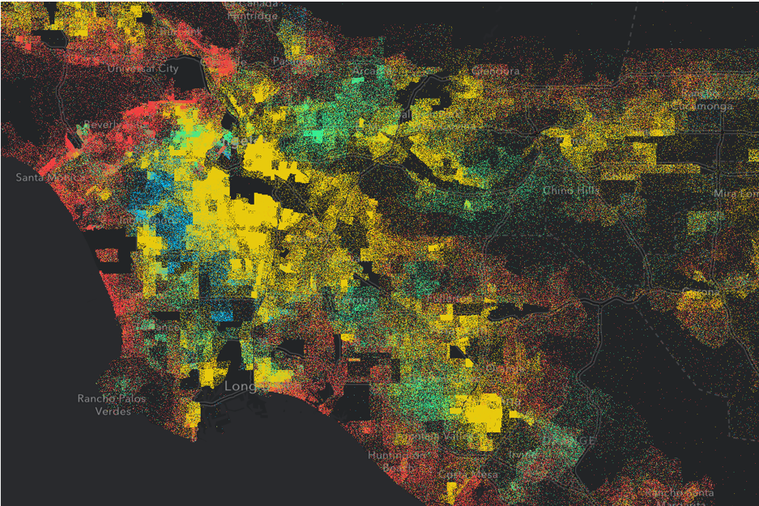

----

## Symbols

- Based on geometry type
- Points
    - SimpleMarkerSymbol, PictureMarkerSymbol, WebStyleSymbol, CIMSymbol
- Lines
    - SimpleLineSymbol
- Polygon
    - SimpleFillSymbol, PictureFillSymbol

----

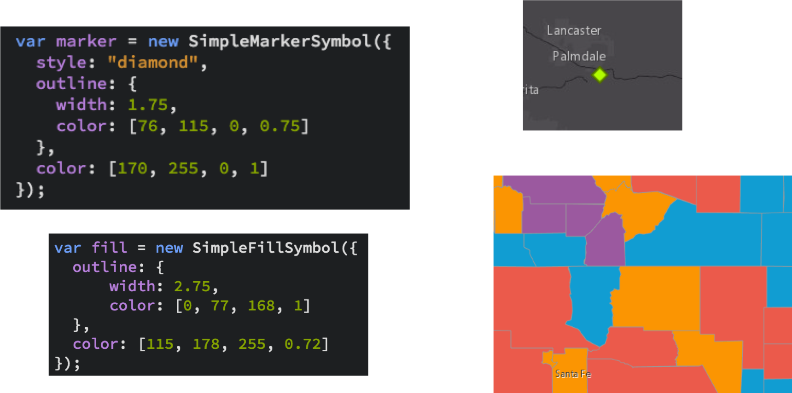

----

## Data

- FeatureCollection
- FeatureLayer
- MapImageLayer
- CSVLayer
- GeoJSONLayer
- StreamLayer

----

## Data-driven

- Field value(s)
    - `TOTAL_POP`
- Arcade expression
    - `Round( ($feature.BACHELOR + $feature.MASTER) / $feature.POP_25UP) );`

----

# Renderers

----

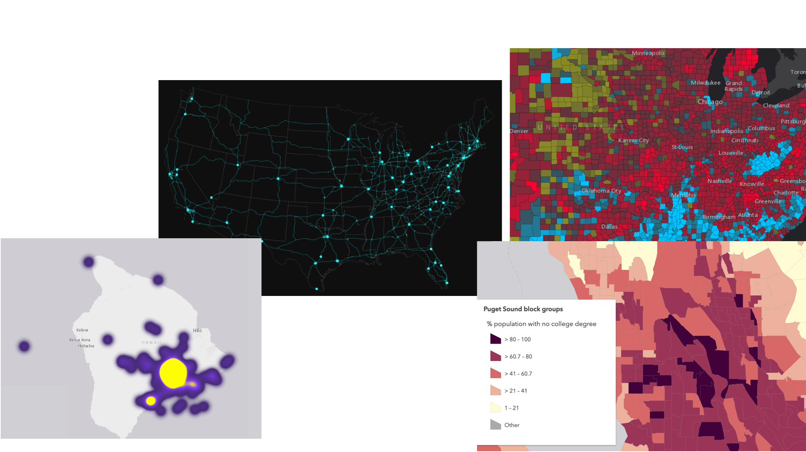

----

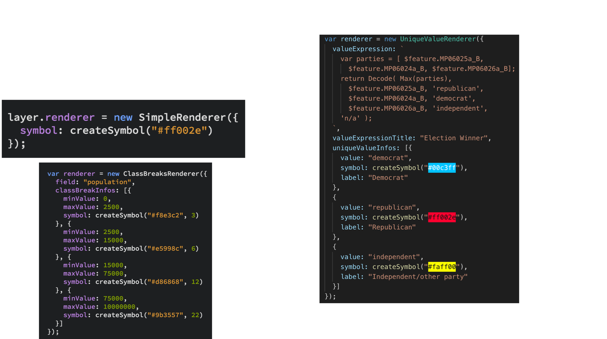

----

### Visual Variables

- For numeric data-driven continuous visualizations
    - Color
    - Size
    - Opacity
    - Rotation

----

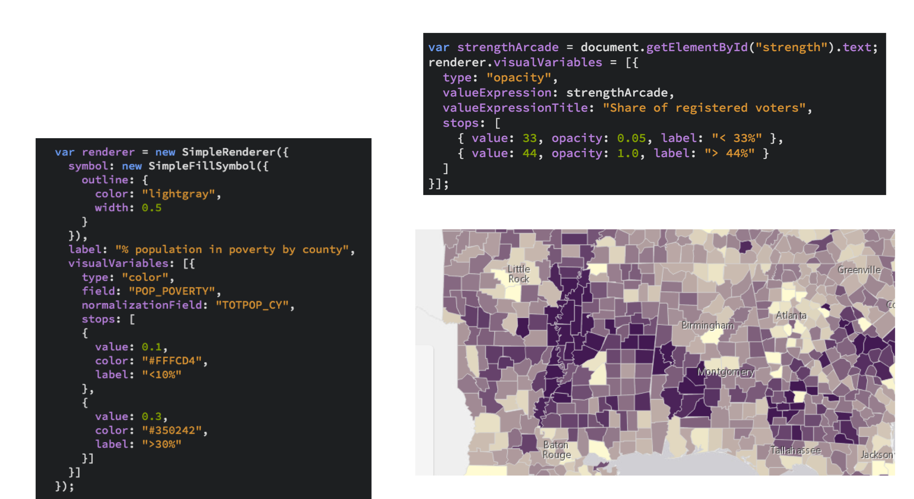

----

# Smart Mapping

----

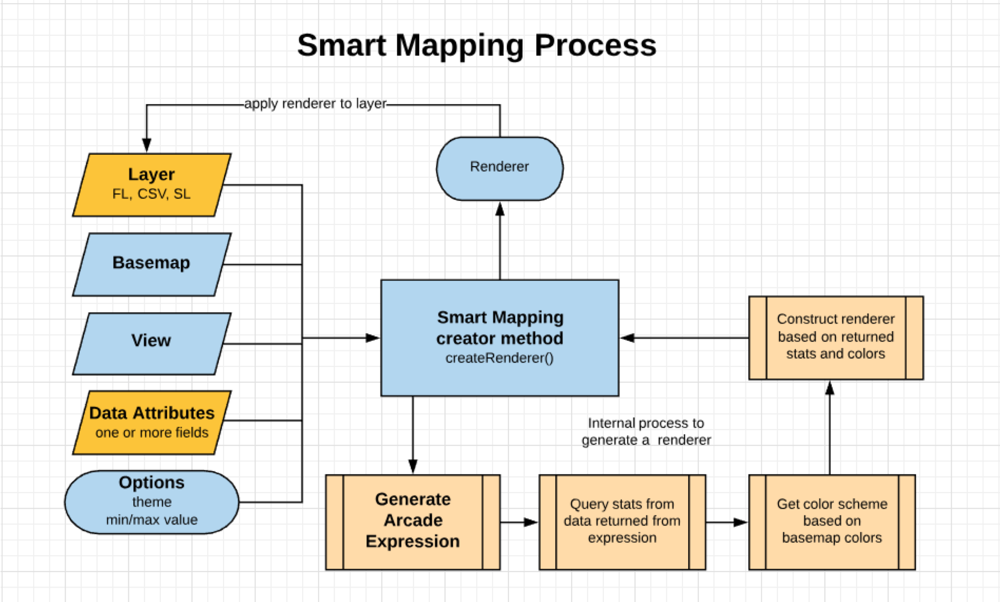

----

### Age

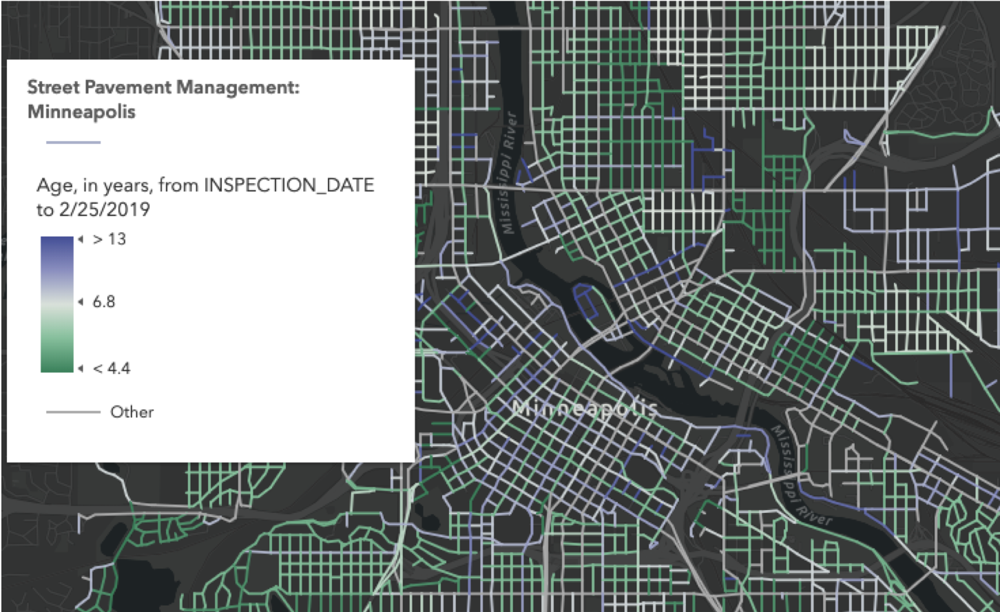

----

### Relationship

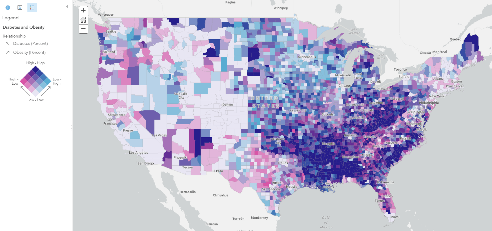

----

### Predominance

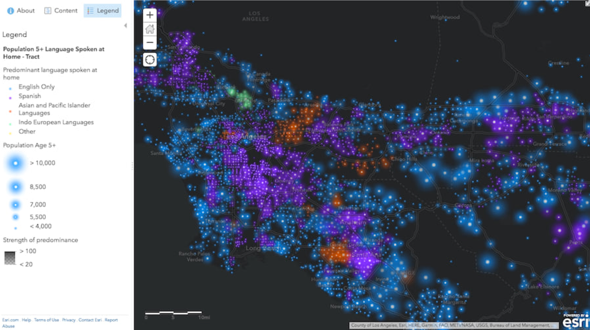

----

### Data Exploration

- [Demo](https://developers.arcgis.com/javascript/latest/sample-code/sandbox/index.html?sample=visualization-histogram-color)

----

## Client-Side

- Client-side queries
- Fast visual variable updates
- Heatmap

[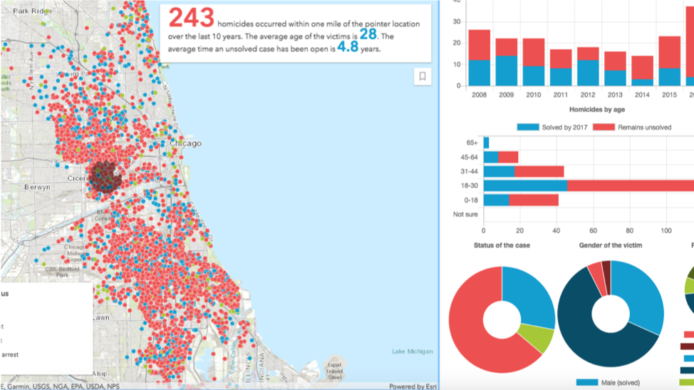](https://developers.arcgis.com/javascript/latest/sample-code/sandbox/index.html?sample=featurelayerview-query-distance)

----

## Dot-density

- [Demo](https://developers.arcgis.com/javascript/latest/sample-code/sandbox/index.html?sample=visualization-dot-density)

```js
const dotDensityRenderer = new DotDensityRenderer({
    dotValue: 100,
    outline: null,
    referenceScale: 577790, // 1:577,790 view scale
    legendOptions: { unit: "people" },
    attributes: [
        {
            field: "B03002_003E",
            color: "#f23c3f",
            label: "White (non-Hispanic)"
        },
        {
            field: "B03002_012E",
            color: "#e8ca0d",
            label: "Hispanic"
        },
        ...
    ]
});
```

----

## 2D WebStyles (CIM)

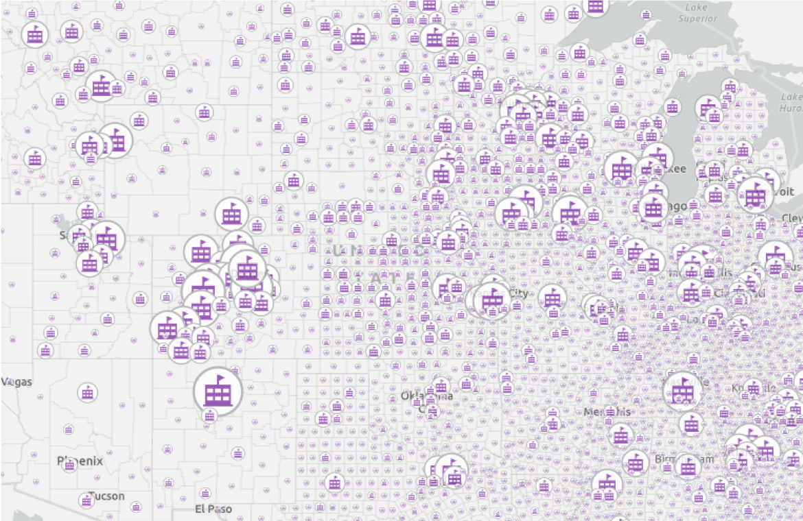

----

## 2D WebStyles

```js
// Update renderer with new web style symbol
function updateRenderer() {
  let renderer = layer.renderer.clone
  var cb = renderer.classBreakInfos[0];
  cb.symbol = new WebStyleSymbol({
    name: "school",
    styleName: "Esri2DPointSymbolsStyle"
  });
  layer.renderer = renderer;
  map.add(layer);
}
```

- [Demo](https://developers.arcgis.com/javascript/latest/sample-code/webstylesymbol-proportional-2d/index.html)

----

## DictionaryRenderer

```js
new DictionaryRenderer({
  url: url,
  fieldMap: {
    fuel_type: "Fuel_Type_Code",
    connector_types: "EV_Connector_Types",
    network: "EV_Network",
    name: "Station_Name"
  },
  config: {
    show_label: "true"
  }
})
```

- [Demo](https://developers.arcgis.com/javascript/latest/sample-code/visualization-dictionary/index.html)

----


----

## Resources

- [Design principles for cartography](https://www.esri.com/arcgis-blog/products/product/mapping/design-principles-for-cartography/)
- [Make your histogram legendary](https://www.esri.com/arcgis-blog/products/js-api-arcgis/mapping/make-your-histogram-legendary/)

----

<!-- .slide: data-background="../common/images/2019_UC_Survey_Slide.png" -->
