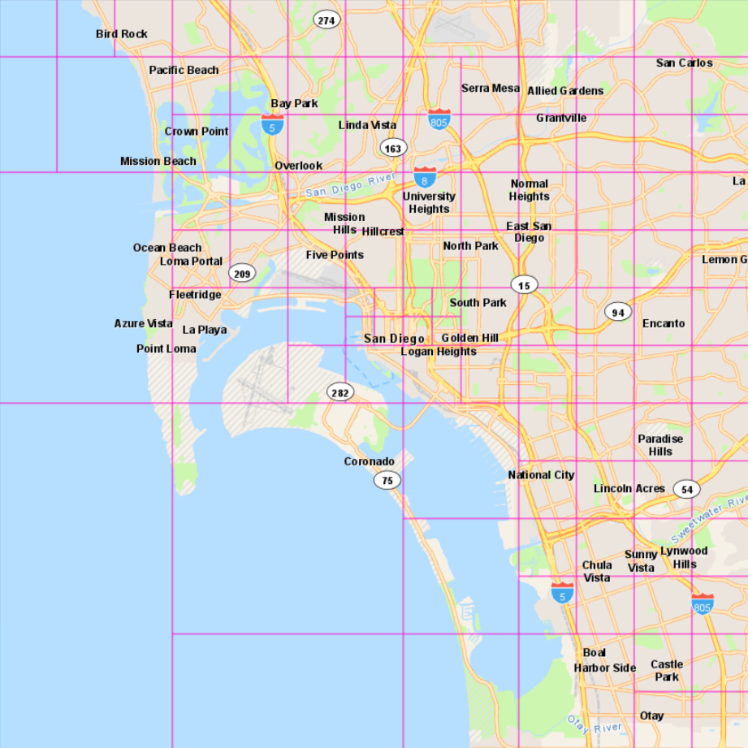
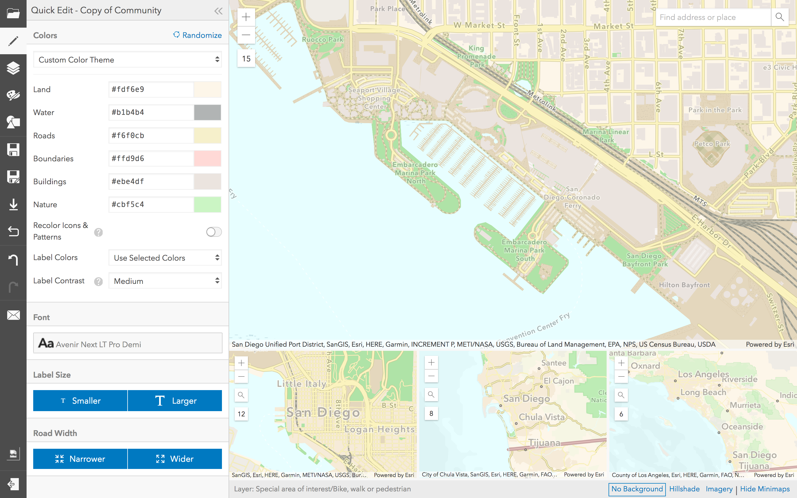

<!-- .slide: data-background="./Images/bg-1.jpeg" -->
<!-- .slide: class="title" -->

<h1 style="text-align: right; font-size: 80px;">Leveraging Vector Tile Layers</h1>
<h2 style="text-align: right; font-size: 60px;">in Web Apps</h2>
<p style="text-align: right; font-size: 30px;">Patrick Arlt | René Rubalcava</p>
    <p style="text-align: right; font-size: 30px;">slides: <a href="https://git.io/fjrz4" target="_blank">https://git.io/fjrz4</a></p>

<!--
Description:
Come to this session to learn about working with vector tile layers in apps built with the ArcGIS API for JavaScript. We’ll show you how you can enable map interactivity and client-side styling, without compromising performance. We’ll also demonstrate the vector tile style editor which can be used to style your own vector tile layers or customize Esri’s vector tile basemaps.
-->

----

### **Agenda**
</br>
 - What are Vector Tiles?
 - Benefits
 - Gotchas
 - Cool stuff

----

<!-- .slide: data-background="./Images/bg-3.jpeg" -->

## **What are Vector Tiles?**

* Geographic data > Pre cooked tiles
* Tiles are just binary data ([PBF](https://docs.mapbox.com/vector-tiles/specification/))
* Styles defined in separate JSON file
* Drawn on the client using Web GL

----

## What is a style?

* `layers` - define how layers of the tiles will rendered
* `glyphs` - font source for the tiles
* `sprite` - sprite images and data, used for patterns and icons
* `sources` - data sources for tiles, can be multiple sources
* `version` - style specification version. always set to `8`

----

<!-- .slide: data-background="./Images/bg-3.jpeg" -->

### **Benefits**

<div style="display:flex; align-items: center;">
  <ul style="width: calc(100% - 650px - 1rem); float: left;">
    <li>Infinite resolution</li>
    <li>Smooth zooming</li>
    <li>Easy to customize</li>
    <li>Low disk space (world = ~20 Gb)</li>
    <li>Fast cook times (world = ~8 hours)</li>
    <li>Indexable</li>
    <li>Overzoom</li>
  </ul>
  
</div>

----


### **Gotchas**

* Attribute data for styling only
* `FeatureLayer` is faster in some cases

----

<!-- .slide: data-background="./Images/bg-3.jpeg" -->

### **Cool stuff**

* [Watercolour basemap](https://www.arcgis.com/home/webmap/viewer.html?webmap=21812b28afea4091bc57472297aa73d4)
* [Vector Tile Style Editor](https://developers.arcgis.com/vector-tile-style-editor)

----

### Vector Tile Style Editor



Customize the style of your own or Esri's vector tiles styles.

[Tutorial](https://developers.arcgis.com/labs/arcgisonline/style-a-vector-basemap/)

----

<!-- .slide: data-background="./Images/bg-3.jpeg" -->

### Loading Styles


```js
// Load by style url
new VectorTileLayer({
    url: 'https://www.arcgis.com/sharing/rest/content/items/.../resources/styles/root.json'
})
```

```js
// Load tile service
// uses default style of service
new VectorTileLayer({
    url: 'https://basemaps.arcgis.com/arcgis/rest/services/World_Basemap_v2/VectorTileServer'
})
```

```js
// Load by portalItem
new VectorTileLayer({
    portalItem: { id: 'itemid' }
})
```

----

### Load Styles

```js
// Load with style JSON
new VectorTileLayer({
  style: {
    version: 8,
    sources: {
      esri: {
        type: "vector",
        url: "https://VectorTileServiceURL"
      }
    },
    layers: [...]
  }
})
```

----

<!-- .slide: data-background="./Images/bg-3.jpeg" -->

### Styles and Interactivity

* Define style by JSON
* Can interact with Vector Style layers
* No attribute data other than what's needed to render
* Geometries can be split on tiles

```js
const vtLayer = new VectorTileLayer({
    style: {
        layers: [...]
        glyphs: ...
        sprite: ...
        sources: { ... }
        version: 8
    }
});
```

----

### Interactivity

```js
view.on("pointer-move", event => {
    view.hitTest(event).then(({ results }) => {
        // returns graphics with attribute data
        // on the layer in the style that you
        // are interacting with
    });
});
```

----

### Interactivity

<iframe height="500" style="width: 100%;" scrolling="no" title="VT - Fun" src="//codepen.io/odoe/embed/preview/ewyrNB/?height=500&theme-id=31222&default-tab=js,result" frameborder="no" allowtransparency="true" allowfullscreen="true">
  See the Pen <a href='https://codepen.io/odoe/pen/ewyrNB/'>VT - Fun</a> by Rene Rubalcava
  (<a href='https://codepen.io/odoe'>@odoe</a>) on <a href='https://codepen.io'>CodePen</a>.
</iframe>

----

### Paint Properties

```js
view.on("pointer-move", event => {
  view.hitTest(event).then(({ results }) => {
    const styles = results.filter(...).map(...);
    styles.forEach(x => {
      const paint = vtLayer.getPaintProperties(x.layerName);
      if (paint["fill-color"]) {
        // change paint fill color
        paint["fill-color"] = chroma.random().hex();
        vtLayer.setPaintProperties(x.layerName, paint)
      }
    });
  });
});
```

----

### Paint Properties

<iframe height="500" style="width: 100%;" scrolling="no" title="VT -  Update Paint 4.12" src="//codepen.io/odoe/embed/preview/dBQvEy/?height=500&theme-id=light&default-tab=js,result" frameborder="no" allowtransparency="true" allowfullscreen="true">
  See the Pen <a href='https://codepen.io/odoe/pen/dBQvEy/'>VT -  Update Paint 4.12</a> by Rene Rubalcava
  (<a href='https://codepen.io/odoe'>@odoe</a>) on <a href='https://codepen.io'>CodePen</a>.
</iframe>

----

### Style App to custom basemaps

* [CSS Style guide](https://developers.arcgis.com/javascript/latest/guide/styling/)
* [Custom themes](https://developers.arcgis.com/javascript/latest/sample-code/sandbox/index.html?sample=styling-simple-theme)

```css
.my-theme .esri-widget,
...
.my-theme .esri-widget a {
  background-color: #c69;
  color: #fff;
}
```

```html
<body class="my-theme">
</body>
```

----

<iframe height="500" style="width: 100%;" scrolling="no" title="Lakers VT 4.12" src="//codepen.io/odoe/embed/preview/bPmbvQ/?height=500&theme-id=31222&default-tab=css,result" frameborder="no" allowtransparency="true" allowfullscreen="true">
  See the Pen <a href='https://codepen.io/odoe/pen/bPmbvQ/'>Lakers VT 4.12</a> by Rene Rubalcava
  (<a href='https://codepen.io/odoe'>@odoe</a>) on <a href='https://codepen.io'>CodePen</a>.
</iframe>

----

<!-- .slide: data-background="./Images/bg-3.jpeg" -->

### **Where can I get more info?**

----

<!-- .slide: data-background="./Images/alias_slide.png" -->

----

<!-- .slide: data-background="./Images/bg-2.png" -->


----

<!-- .slide: data-background="./Images/2019_UC_Survey_Slide.png" -->
