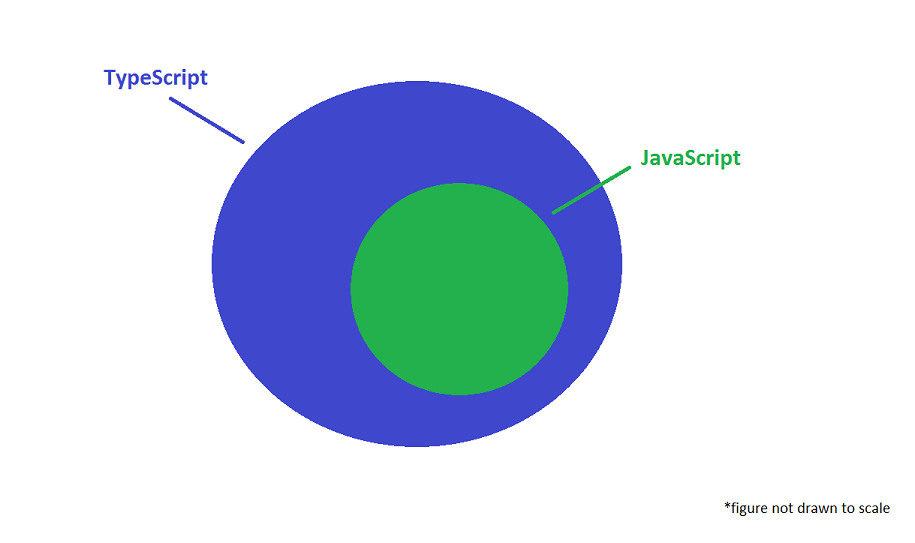
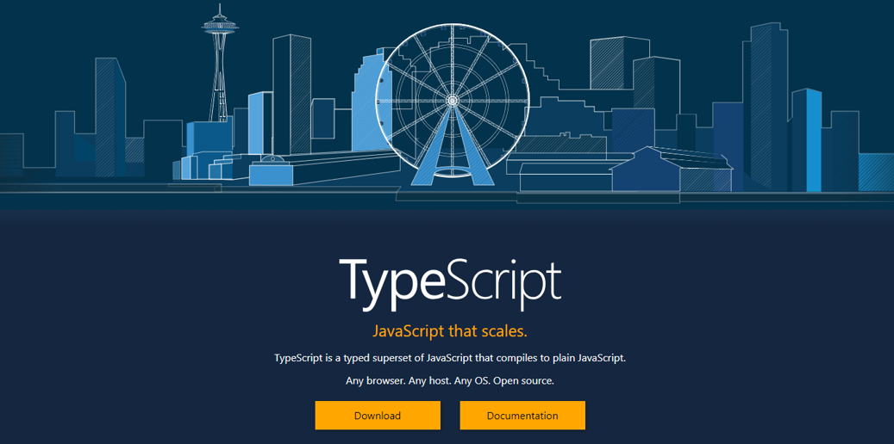
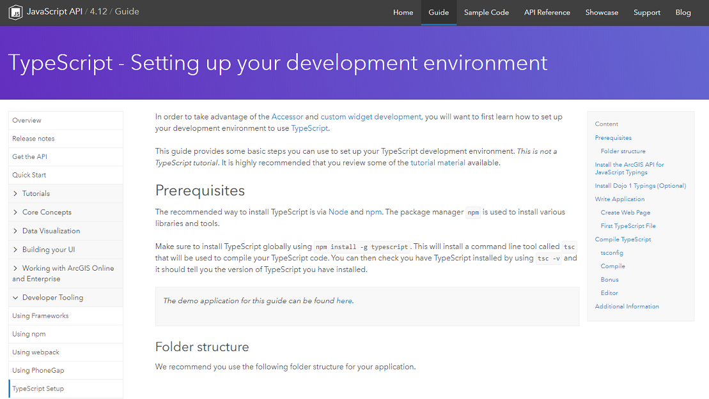
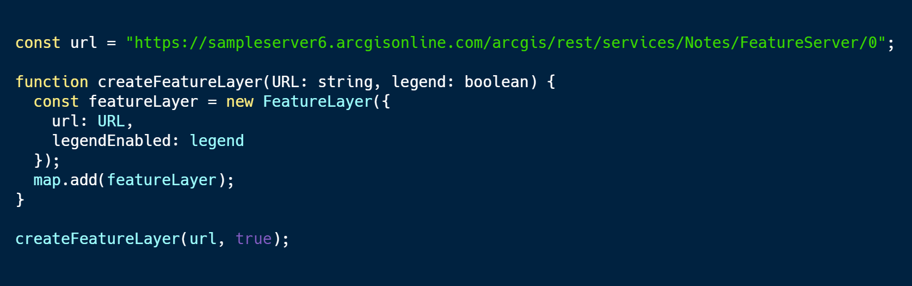
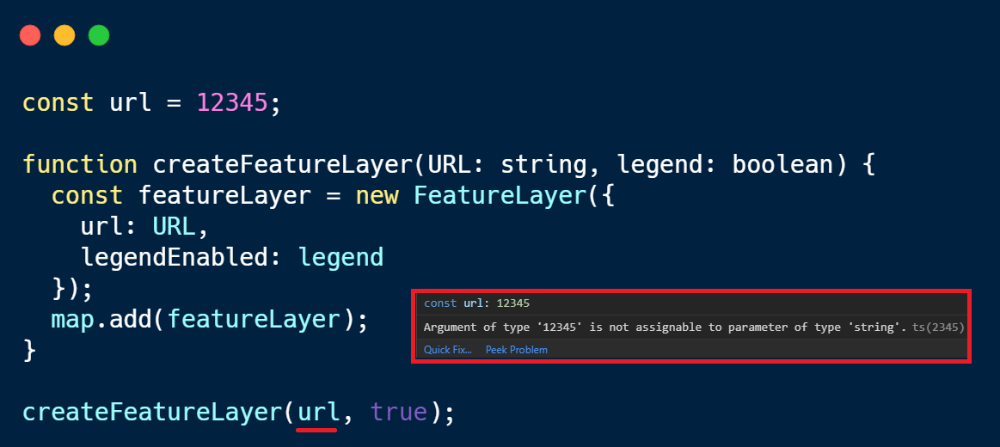
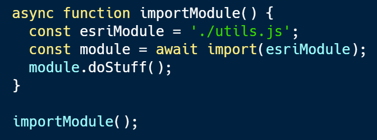
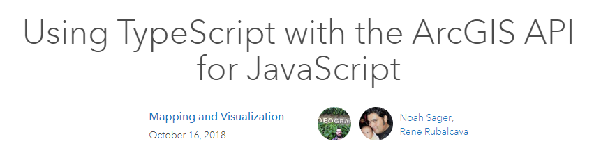

<!-- .slide: data-background="./Images/bg-1.jpeg" -->
<!-- .slide: class="title" -->

<h1 style="text-align: right; font-size: 80px;">Using TypeScript</h1>
<h2 style="text-align: right; font-size: 60px;">with ArcGIS API for JavaScript</h2>
<p style="text-align: right; font-size: 30px;">Noah Sager | René Rubalcava</p>
    <p style="text-align: right; font-size: 30px;">slides: <a href="https://git.io/fj2Ej" target="_blank">https://git.io/fj2Ej</a></p>

----

### **Agenda**
</br>
 - What is TypeScript?
 - Why use TypeScript?
 - Setup and First steps
 - Live Action Demo
 - Where can I get more info?

----

### **What is TypeScript?**
<a href="https://www.typescriptlang.org/" target="_blank">

</a>

----

### **Where do I begin?**
<a href="https://www.typescriptlang.org/" target="_blank">

</a>

----

### **Developer Setup**
<a href="https://developers.arcgis.com/javascript/latest/guide/typescript-setup/index.html" target="_blank">

</a>

----

### **Why use TypeScript?**
</br>
TypeScript adds **type** support to JavaScript
</br>
</br>


----

### **Why use TypeScript?**
</br>
Enhanced IDE support
</br>


----

### **Why use TypeScript?**
</br>
Makes use of the latest JavaScript features
</br>
</br>


----

### **Why use TypeScript?**
</br>
Makes use of the latest JavaScript features
</br>
</br>


----

### **Setup and First steps**

1. The recommended way to install TypeScript is via `node` and `npm`.

2. Make sure to install TypeScript globally: <br>
```bash
npm install -g typescript
```
3. Install the ArcGIS API for JavaScript Typings: <br>
```bash
npm install --save @types/arcgis-js-api
```

----
<!-- .slide: data-background="./Images/bg-3.jpeg" -->

### **Demo: Build a TypeScript app from scratch**
</br>

----
### **Tip: Hide .js and .jsmap files **

- Reduce clutter
- VSCode: Add below to user preferences in files.exclude

```json
 "**/*.js.map": true,
        "**/*.js": {
            "when": "$(basename).ts"

```

----

### **Tip: Debugging with source maps**
  - Enable source maps in browser dev tools
  - Set breakpoints in .ts instead of .js

  

----

### **Tip: Use __esri instead of import**
- Only contains type interfaces
- Can use when not instantiating type

```ts
import esri = __esri;

const layerList = new LayerList({
  view,
  listItemCreatedFunction: event => {
    const item = event.item as esri.ListItem;
  }
});
```

----

### **Where can I get more info?**

- SDK Documentation
- Esri-related training and webinars
- ArcGIS Blogs
- GeoNet, StackExchange, Spatial Community in Slack, etc.</br>
</br>
<a href="https://www.esri.com/arcgis-blog/products/js-api-arcgis/mapping/using-typescript-with-the-arcgis-api-for-javascript/" target="_blank">


----

<!-- .slide: data-background="./Images/2019_UC_Survey_Slide.png" -->

---

<!-- .slide: data-background="./Images/bg-esri.png" -->

